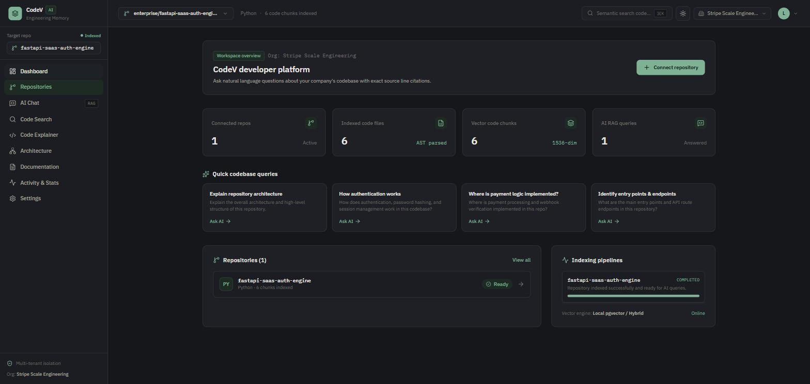
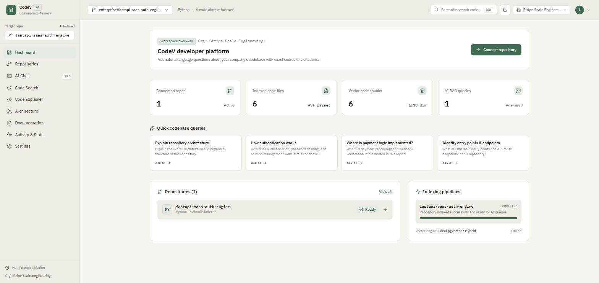
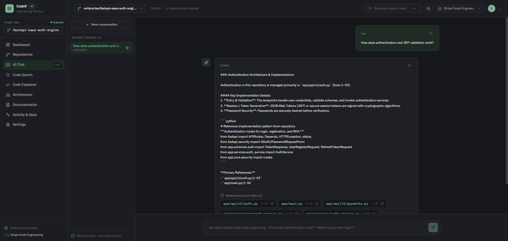
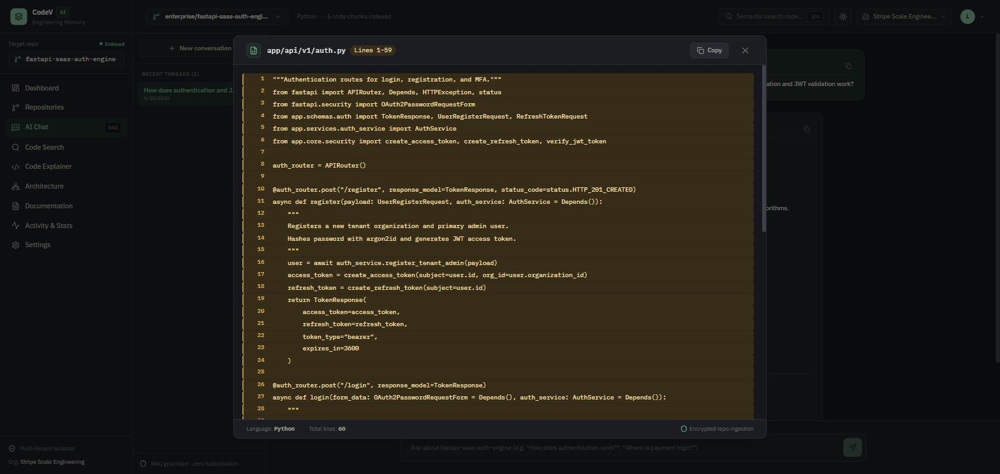
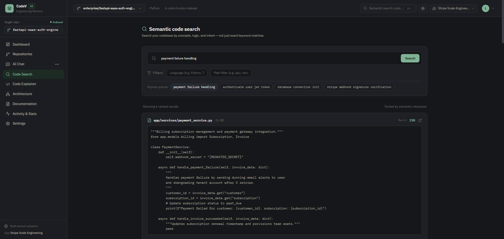
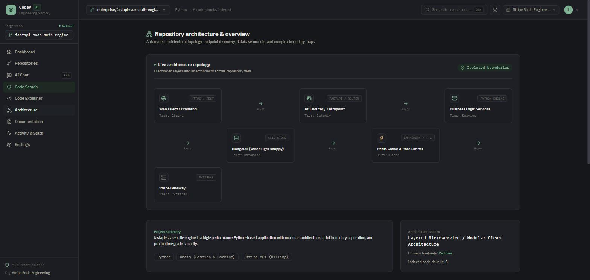
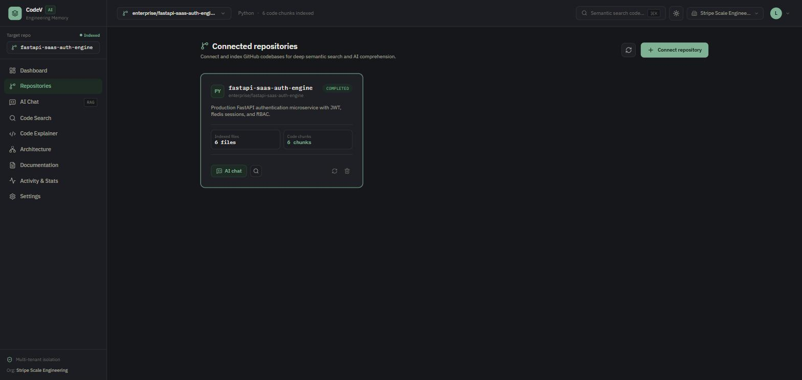
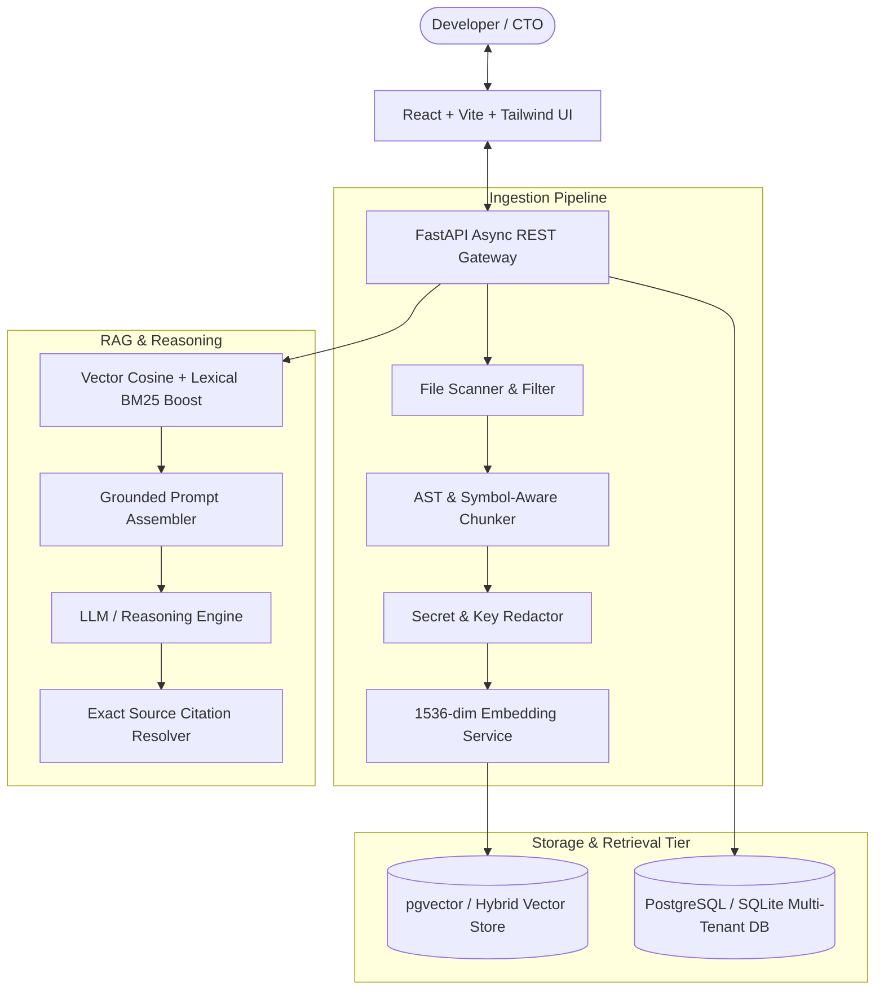

# CodeV 🚀

> **The Engineering Memory of Your Company** — AI-powered Developer Knowledge Platform that understands your GitHub repositories and delivers source-backed codebase intelligence with clickable line citations.

---

## 📸 Screenshots

| Dashboard (dark) | Dashboard (light) |
| :---: | :---: |
|  |  |

| AI Chat with source citations | Code Viewer (clickable citation) |
| :---: | :---: |
|  |  |

| Semantic Code Search | Architecture Overview |
| :---: | :---: |
|  |  |

| Connected Repositories |
| :---: |
|  |

---

## 🌟 Product Vision

Modern engineering teams spend up to **30% of their time** reading code to understand:
- *"How does authentication work?"*
- *"Where is payment logic implemented?"*
- *"Which files handle JWT validation?"*
- *"Explain the repository architecture and entry points."*
- *"Find all places where user permissions or Stripe webhooks are checked."*

**CodeV** connects directly to your company's GitHub repositories, creates an AST-aware semantic knowledge graph, and provides instant, source-backed answers with clickable file and line references (`auth/routes.py:42–68`).

---

## 🏗️ Architecture Overview



---

## ⚡ Core Features

| Feature | Description |
| :--- | :--- |
| **🛡️ Multi-Tenant Auth** | JWT authentication, bcrypt hashing, organization workspaces, and strict tenant isolation. |
| **🐙 GitHub Integration** | Connect repositories via URL, Personal Access Tokens, or 1-click instant starter templates. |
| **⚙️ Code Ingestion** | Smart file discovery, `.gitignore` filtering, language detection (Python, JS, TS, Go, Java, Rust, HTML, CSS, SQL), AST symbol extraction, and secret scrubbing. |
| **🔍 Hybrid RAG Pipeline** | Vector similarity combined with lexical keyword and symbol boosts for high-precision retrieval. |
| **💬 ChatGPT-Style Chat** | Interactive chat with rich markdown, syntax-highlighted code blocks, copy buttons, and clickable source pills. |
| **🔎 Code Viewer & Explainer** | Click any citation to view the highlighted line range in the Code Viewer, with 1-click deep AST code decomposition (Inputs, Outputs, Dependencies, Logic, Edge cases, Security pitfalls). |
| **🌐 Semantic Code Search** | Search code by intent and concepts with relevance meters, line numbers, and snippet previews. |
| **🗺️ Repository Architecture Overview** | Automated tech stack badges, entry points, REST endpoints table, database models, external services, and interactive SVG topology graph. |
| **📝 Documentation Generator** | Generate production-grade README, API specs, Architecture guides, and Developer Onboarding guides in Markdown. |
| **📊 Telemetry & Audit Trail** | Track query latencies, vector chunks, token counts, and indexing job history. |

---

## 🛠️ Tech Stack

### Frontend
- **Framework**: React 18 + TypeScript + Vite
- **Styling**: Tailwind CSS (Dark-first developer aesthetic with Glassmorphism)
- **Icons**: Lucide Icons
- **Routing**: React Router DOM v6

### Backend
- **Framework**: Python FastAPI
- **Data Validation**: Pydantic v2
- **ORM & DB**: SQLAlchemy 2.0 (PostgreSQL / SQLite)
- **Vector Storage**: pgvector & high-speed NumPy/Cosine hybrid engine
- **Embeddings & LLM**: OpenAI / Google Gemini / Anthropic / Zero-config deterministic fallback engine

### Infrastructure
- **Containerization**: Docker & Docker Compose (`pgvector/pgvector:pg16`, FastAPI, Nginx)

---

## 🚀 Quick Start (Local Development)

### 1. Prerequisites
- Python 3.10+
- Node.js 18+ & npm
- Git

### 2. Clone and Setup Environment
```bash
git clone https://github.com/your-org/CodeV-ai.git
cd CodeV-ai
cp .env.example .env
```

### 3. Start Backend
```bash
# In project root:
cd backend
pip install -r requirements.txt
uvicorn app.main:app --reload --port 8000
```
Backend API will be running at `http://localhost:8000` with Swagger docs at `http://localhost:8000/docs`.

### 4. Start Frontend
```bash
# In a new terminal:
cd frontend
npm install
npm run dev
```
Frontend application will be running at `http://localhost:5173`.

---

## 🐳 Docker Deployment

To launch the complete multi-container production stack (PostgreSQL + pgvector, FastAPI, and Vite/Nginx):

```bash
docker compose up --build
```
- **Web UI**: `http://localhost:3000`
- **Backend API**: `http://localhost:8000`
- **PostgreSQL pgvector**: `localhost:5432`

---

## 🧪 Running Tests

### Backend Tests
```bash
pytest backend/tests/test_backend.py -v
```

### Frontend Build Verification
```bash
cd frontend
npm run build
```

---

## 📂 Project Structure

```text
CodeV-ai/
├── docker-compose.yml
├── .env.example
├── README.md
├── backend/
│   ├── Dockerfile
│   ├── requirements.txt
│   ├── app/
│   │   ├── main.py
│   │   ├── config/          # Environment & Pydantic settings
│   │   ├── database/        # SQLAlchemy engine & session
│   │   ├── models/          # Multi-tenant DB models
│   │   ├── schemas/         # Pydantic request & response schemas
│   │   ├── auth/            # JWT, bcrypt & dependencies
│   │   ├── github/          # GitHub API & sample repo templates
│   │   ├── ingestion/       # Scanner, AST chunker, secret filter
│   │   ├── embeddings/      # Embedding service abstraction
│   │   ├── vectorstore/     # Hybrid vector store
│   │   ├── rag/             # Grounded RAG reasoning & citations
│   │   └── api/             # REST endpoint routers (auth, repos, chat, search, etc.)
│   └── tests/               # Backend test suite
└── frontend/
    ├── Dockerfile
    ├── nginx.conf
    ├── package.json
    ├── vite.config.ts
    ├── index.html
    └── src/
        ├── App.tsx
        ├── main.tsx
        ├── index.css
        ├── types/           # TypeScript interfaces
        ├── services/        # HTTP API client
        ├── context/         # Auth & active repo state
        ├── components/      # Sidebar, Header, CodeViewerModal, ArchitectureDiagram
        └── pages/           # Dashboard, Repositories, Chat, Search, Explainer, Architecture, Docs, Activity, Settings
```

---

## 🔒 Security & AI Safety Principles

1. **Strict Multi-Tenancy**: Data and vector embeddings are partitioned by organization ID.
2. **Secret Scrubbing**: Automatic detection and redaction of API keys (`sk-`, `ghp_`, `AKIA`) and `.env` files during ingestion.
3. **Grounded Source Verification**: Prompts and citations strictly reference indexed chunks to eliminate hallucinations.
4. **Token Protection**: OAuth tokens and API secrets are never exposed to client-side code.

---

## 📄 License
MIT License. Built for high-velocity software engineering teams.
